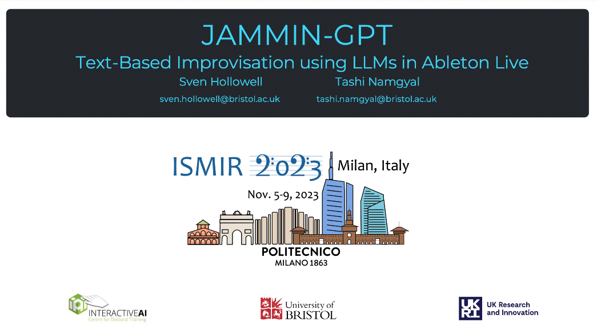
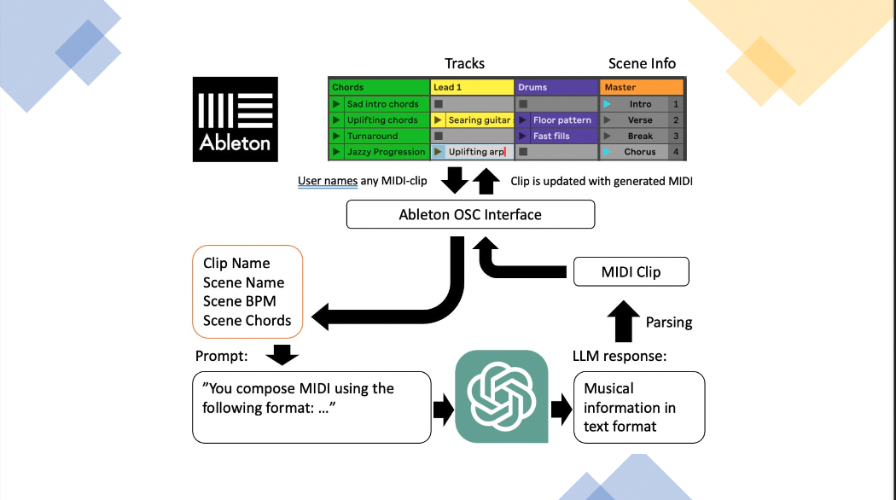
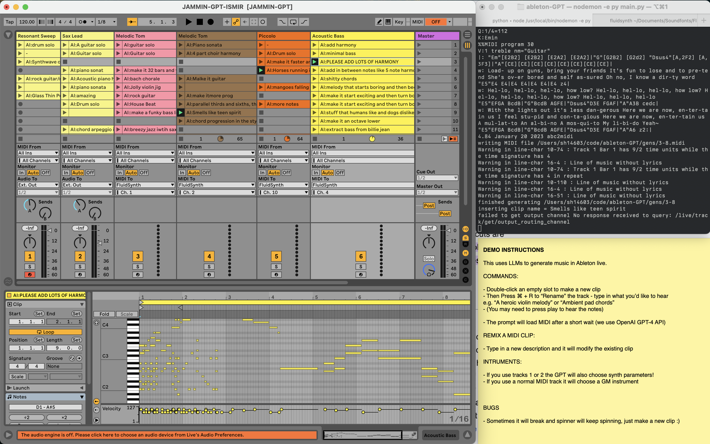
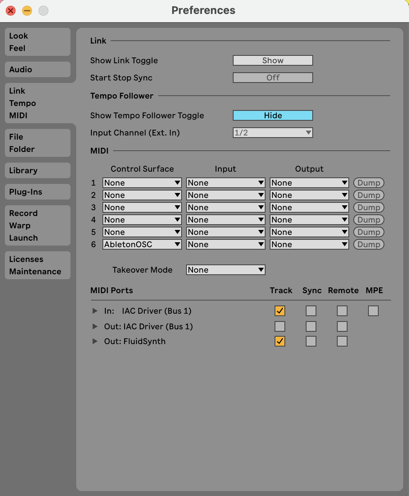

# JAMMIN-GPT
[**Paper**](https://arxiv.org/pdf/2312.03479.pdf) | [**ISMIR Poster**](https://ismir2023program.ismir.net/lbd_356.html) 





### Requirements
- abc2midi - https://abcmidi.sourceforge.io/
    - `brew install abc2midi`
    - if not installed using homebrew set path here: 
https://github.com/supersational/JAMMIN-GPT/blob/main/generate_midi.py#L15
- pip install openai>=1.1.1 rtmidi mido==1.3.0
- place 'client' folder in Ableton's Remote Scripts folder
(for me it's in `/Users/sven/Music/Ableton/User Library/Remote Scripts/AbletonOSC/client/`)

### Optional Requirements:
- fluidsynth (to use GM soundfonts)
    - run fluidsynth and select it as an output MIDI device in Ableton with 1 channel per track
    - `fluidsynth path_to_soundfont/FluidR3_GM.sf2 -pFluidSynth` is the command I use


### Screenshot



### Add AbletonOSC as a control surface in Ableton


### Run the python script

In a seperate terminal window run:
```bash
python main.py
```

- You should see the output: `waiting for named MIDI clip to appear..`
- Now create an empty MIDI clip in Ableton and rename it something like: "piano arp"
  - Create MIDI clip shortcut: `cmd+shift+m`
  - Rename MIDI clip shortcut: `cmd+r`
- If the script works correctly the clip's name should change
- The MIDI clip should now contain LLM-generated music, make some more!

### Debugging

- Make sure you have added AbletonOSC as a control surface in Ableton
- Sometimes there is an orange colored message in the bottom status bar of Ableton
- There are ways to debug remote scripts in Ableton and see print statements, guides can be found online