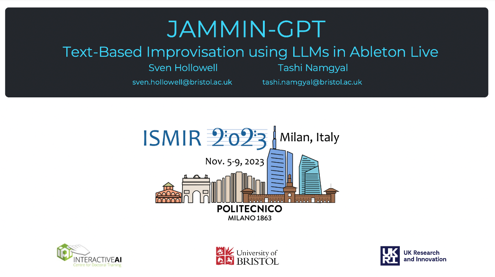
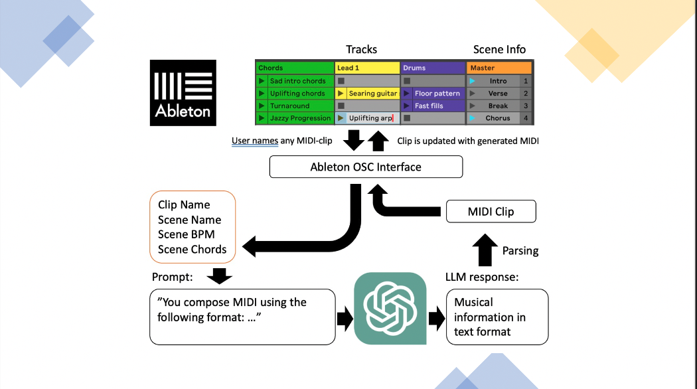
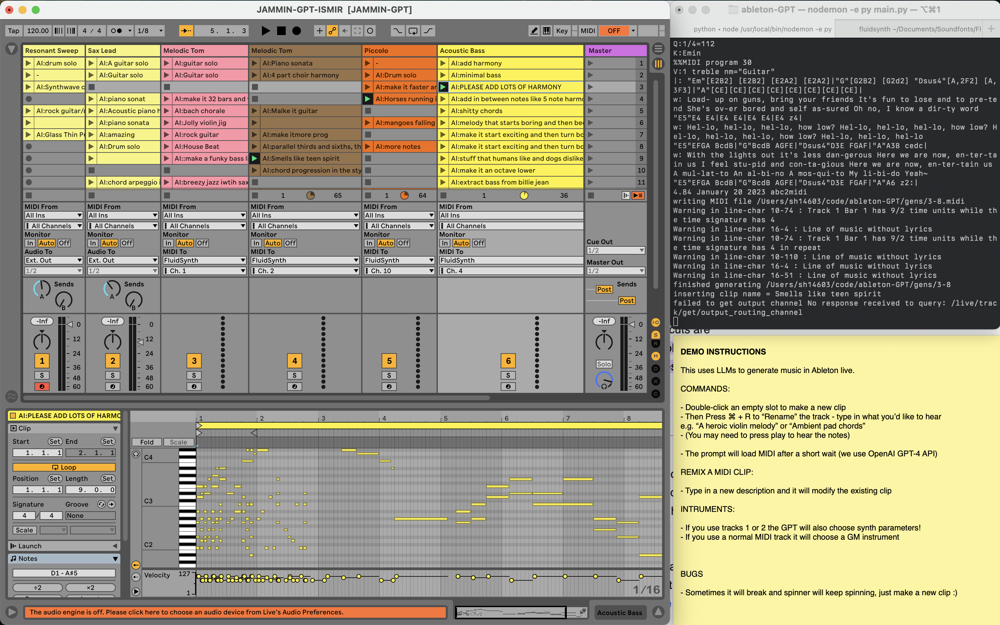
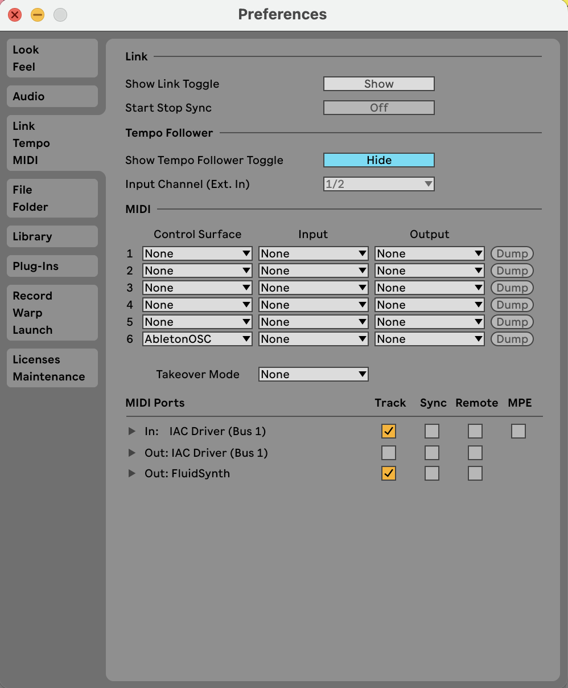

# JAMMIN-GPT
[**Paper**](https://arxiv.org/pdf/2312.03479.pdf) | [**ISMIR Poster**](https://ismir2023program.ismir.net/lbd_356.html) 

**Updates**
- 2026-01-14: Updated to use [mtxt](https://github.com/Daninet/mtxt) instead of ABC notation - this is a new syntax designed for LLMs to write music more effectively, and allows editing existing MIDI clips (since it supports MIDI -> mtxt -> MIDI conversion)





### Requirements
- pip install -r requirements.txt
- place 'client' folder in Ableton's Remote Scripts folder
(for me it's in `/Users/sven/Music/Ableton/User Library/Remote Scripts/AbletonOSC/client/`)

### Optional Requirements:
- fluidsynth (to use GM soundfonts)
    - run fluidsynth and select it as an output MIDI device in Ableton with 1 channel per track
    - `fluidsynth path_to_soundfont/FluidR3_GM.sf2 -pFluidSynth` is the command I use


### Screenshot



### Add AbletonOSC as a control surface in Ableton


### Run the python script

In a seperate terminal window run:
```bash
python main.py
```

- You should see the output: `waiting for named MIDI clip to appear..`
- Now create an empty MIDI clip in Ableton and rename it something like: "piano arp"
  - Create MIDI clip shortcut: `cmd+shift+m` or `cmd+shift+t` (Live 12)
  - Rename MIDI clip shortcut: `cmd+r`
- If the script works correctly the clip's name should change
- The MIDI clip should now contain LLM-generated music, make some more!

### Debugging

- Make sure you have added AbletonOSC as a control surface in Ableton
- Sometimes there is an orange colored message in the bottom status bar of Ableton
- There are ways to debug remote scripts in Ableton and see print statements, guides can be found online


### Citation
If you find this useful, please consider citing our work:
```
@inproceedings{hollowell2023jammin,
  title={Jammin-gpt: Text-based Improvisation using LLMs in Ableton Live},
  author={Hollowell, Sven and Namgyal, Tashi and Marshall, Paul},
  booktitle={23rd International Society for Music Information Retrieval Conference: Late Breaking/Demo Session},
  year={2023}
}
```
